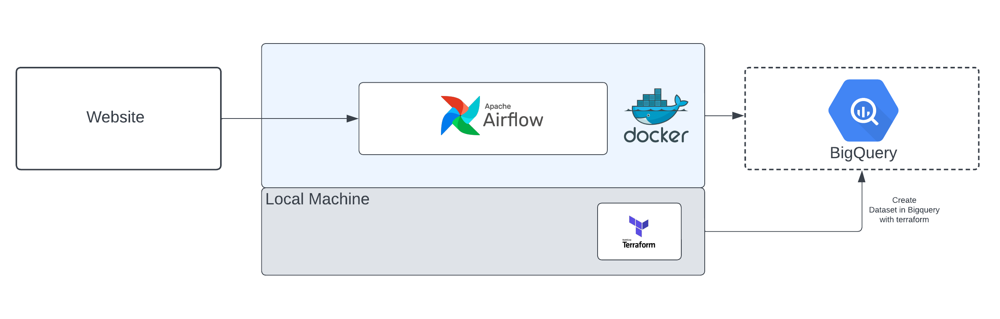

# Building Data Pipeline Using Airflow, Docker, Terraform and Google Bigquery



## How to run this project
First of all you need to clone this project.

### Terraform

Membuat resource menggunakan terraform, pergi ke folder terraform:

```
cd terraform
```

Lalu inisiasi terraform dengan menggunakan perintah:

```
terraform init
```

Dan buat resource dataset pada google bigquery menggunakan perintah:

```
terraform apply
```

Silahkan lakukan pengecekan pada google console, apakah resource yang telah kita buat reflected pada bigquery

### Airflow

Pergi ke folder airflow

```
cd airflow
```

Inisiasi airflow menggunakan docker-compose dan Dockerfile menggunakan perintah:

```
docker compose up airflow-init
```

Tunggu beberapa menit, setelah berhasil jalankan kontainer menggunakan perintah:

```
docker-compose up
```

Silahkan masuk pada Airflow webserver menggunakan web browser dengan laman `localhost:8080`.

Jika ingin stop container, jalankan perintah:

```
docker-compose down
```

## Blog
You can access on (https://rizkybarok.com)

